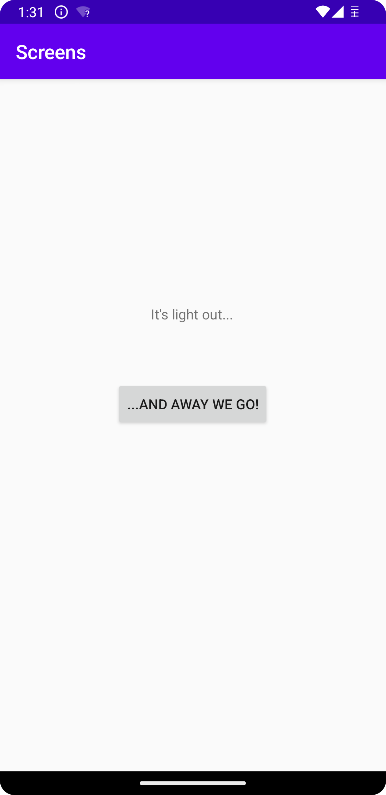
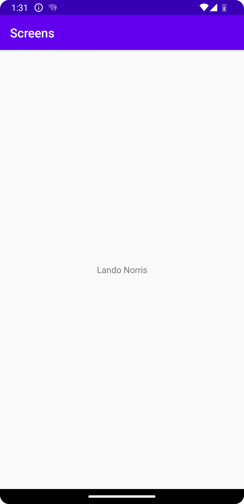

# Rapport

Har lagt till en ny knapp och en ny activity. Knappen har aktiverats så att denna tar 
användaren till den sekundära aktviteten. Den första aktiviteten har en intent som innehåller namn 
och nummer, den sekundära aktiviteten tar sedan emot denna information och visar endast namnet.

```
/*Intent som innehåller namn och nummer som ska följa med till den andra aktiviteten.*/
(...)
Intent intent = new Intent(MainActivity.this, MainActivity2.class);
                intent.putExtra("name", "Lando Norris"); 
                intent.putExtra("number", 4); 
                startActivity(intent);
                
/*Visar infomationen från vår intent, men endast namnet.*/
        Bundle extras = getIntent().getExtras();
        if (extras != null) {
            String name = extras.getString("name");
            int number = extras.getInt("number");
            textView.setText(name);
```




Läs gärna:

- Boulos, M.N.K., Warren, J., Gong, J. & Yue, P. (2010) Web GIS in practice VIII: HTML5 and the canvas element for interactive online mapping. International journal of health geographics 9, 14. Shin, Y. &
- Wunsche, B.C. (2013) A smartphone-based golf simulation exercise game for supporting arthritis patients. 2013 28th International Conference of Image and Vision Computing New Zealand (IVCNZ), IEEE, pp. 459–464.
- Wohlin, C., Runeson, P., Höst, M., Ohlsson, M.C., Regnell, B., Wesslén, A. (2012) Experimentation in Software Engineering, Berlin, Heidelberg: Springer Berlin Heidelberg.
